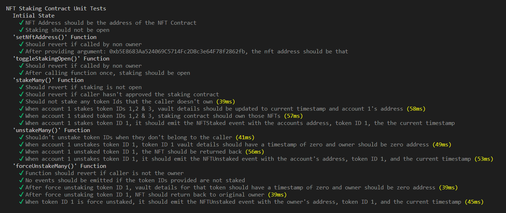
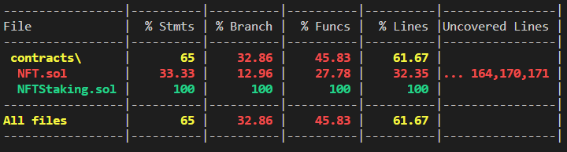
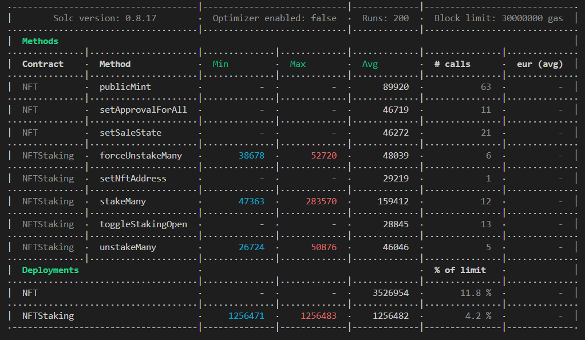

# NFT Staking Contract

This is a contract that allows holders of an ERC721A token standard NFT collection to stake their NFTs.

## About the Contract

The staking contract is integrated with an ERC721A NFT minting contract. Holders of that NFT contract can interact with the staking contract to stake their NFTs. The contract holds the NFTs until they are unstaked by the original owner, or force unstaked by the contract owner.

The contract is also very minimal, and provides a solid, gas-optimized foundation to add additional features such as staking rewards.

## Testing, Coverage, and Gas Report
The following images are the contract's testing & coverage results, as well as the gas report.

## Technologies Used
- Solidity
- Hardhat
- Hardhat Gas Reporter
- Solidity Coverage
- ERC721A & OpenZeppelin Contracts
- TypeScript

